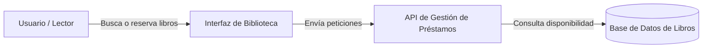

# Sistema de Gestión de Biblioteca

Aplicación web diseñada para la administración y préstamo de libros en línea.
Permite a los usuarios explorar el catálogo disponible, gestionar préstamos activos 
y registrar nuevos ejemplares de forma rápida e intuitiva.


---

## Tabla de contenidos

- [Descripción](#descripción)
- [Instalación y Uso](#instalación-y-uso)
- [Estado de Funcionalidades](#estado-de-funcionalidades)
- [Tareas Pendientes](#tareas-pendientes)
- [Arquitectura del Proyecto](#arquitectura-del-proyecto)
- [Contribuidores](#contribuidores)

---

## Descripción

El proyecto facilita la organización de una biblioteca digital mediante una interfaz accesible.
Está enfocado en agilizar la búsqueda de títulos y el control del inventario bibliográfico.

---

## Instalación y Uso

Ejecuta los siguientes comandos en tu terminal para clonar e iniciar la aplicación:

```bash
# Clonar el repositorio
git clone [https://github.com/larrycarrion-ops/app-biblioteca.git](https://github.com/larrycarrion-ops/app-biblioteca.git)

# Entrar a la carpeta del proyecto
cd app-biblioteca

# Instalación de dependencias
npm install

# Iniciar la aplicación
npm start
```
# estado-de-funcionalidades

| Función             |Modulo         | Estado      | 
|---------------------|---------------|-------------|
| catalogo de libros  |vista principal| Listo       |
| Registro de usuarios|Autenticacion  | En progreso |

## tareas-pendientes 
 
- [x] Diseño de la base de datos
- [ ] Pruebas unitarias
- [x] Conectar la base de datos para la busqueda de ejemplares

## Arquitectura-del-proyecto
 

## Contribuidores

- **Nombre:** Larry Carrión
- **GitHub:** [@larrycarrion-ops](https://github.com/larrycarrion-ops)
